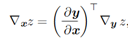

# min_grad
This is a minimal back-propagation Python package designed for educational purposes, inspired by Andrej Karpathy's excellent work on micrograd.

## Chain Rule of Calculus

This is the equation for the chain rule of calculus. Suppose z = f(g(x)) = f(y) , where z is typically the loss. The gradient of the loss ∂z/∂x is sum of the products of the local derivative  ∂y/∂x and the gradient of the loss with respect to y, ∂z/∂y.

In vector or matrix notation, the back-propagation algorithm consists of performing such a Jacobian-gradient product for each operation in the graph.

The Jacobian represents the "local" partial derivatives, in contrast to the gradients with respect to all weights, which propagate backwards.

## Flow Chart of Forward and Backward Propagations

Below is a flow chart of forward and backward propagation for a single node. (Top) The data flows from left to right during forward propagation, and then the gradients flow from right to left during back-propagation. Notice the gradients accumulate from other operations in the same layer (depicted with dotted lines below).

## Common Pitfalls
The chain rule of calculus may appear clean and straightforward compared to traditional statistical models, but there are many pitfalls when implementing it.

[Common pitfalls](docs/pitfalls.md)

## References
1. [micrograd by Andrej Karpathy](https://github.com/karpathy/micrograd)
2. [picograd by ickma](https://github.com/ickma/picograd)

